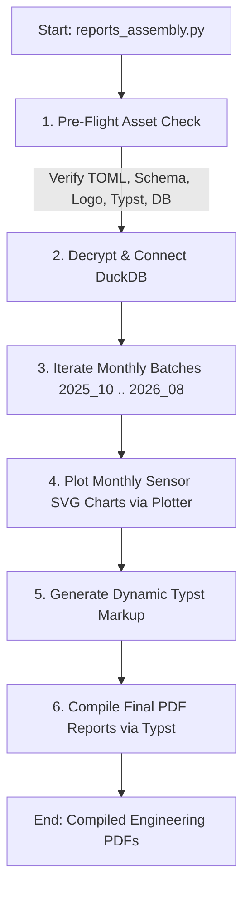

# PRJ-19: Automated Data Pipeline & Engineering Report Generator

[](https.python.org)
[](https://duckdb.org/)
[](https://typst.app/)

An end-to-end automated analytical pipeline, data transformation suite, and publication-ready PDF report generator built for structural displacement monitoring on the **M2717 - Slovenská Ľupča** bridge project (**PRJ-19**).

---

## 🔑 Security & Review Notice

> [!IMPORTANT]
> **Database Credentials Requirement**: The pipeline relies on an AES-encrypted DuckDB database asset. Complete execution of `reports_assembly.py` **will work only with `DB_PASS` (or `DP_PASS`)** configured in your local `.env` file. 
>
> The codebase is fully finalized, verified, self-contained, and **ready to be reviewed**. Pre-compiled sample PDF engineering reports are available in [`report_build/`](file:///home/medvedku/Projects/PRJ19/report_build).

---

## 🎯 Main Purpose & Core Entrypoint (`reports_assembly.py`)

The central purpose of this repository is orchestrating raw structural sensor telemetry into high-precision vector plots and compiling formatted engineering reports for stakeholders.

The entrypoint script **`reports_assembly.py`** automates the entire document build flow:



### Key Workflow Stages in `reports_assembly.py`:
1. **Pre-flight Static Asset Verification (`verify_static_assets`)**:
   - Ensures `config.toml`, `config/schema_mapping.json`, `report_build/template.typ`, and `report_build/Metrotech01.svg` exist on disk.
   - Validates active database connection and confirms table existence (`sensors`, `hubs`, `measurements_span1..5`).
2. **Database & Metadata Loading**:
   - Decrypts `PRJ-19.duckdb` using `DB_PASS` (automatically downloading the asset from GitHub releases if not present locally).
   - Loads structural span hubs and sensor configurations.
3. **Batch Processing Loop**:
   - Loops over target monitoring months (October 2025 – August 2026).
   - For each span and DLeaf sensor, invokes `plot_monthly_sensor_data()` to generate crisp A4 landscape SVG charts.
4. **Typst Markup Generation & PDF Compilation**:
   - Assembles `#fullpage-image` markup referencing absolute vector chart paths.
   - Adds automatic generation timestamps and repository citation notes.
   - Invokes `typst.compile()` to publish final PDFs (`PRJ19_report_MM_YYYY.pdf`) to `report_build/`.

---

## 📂 Repository Architecture & Sub-Modules

| Sub-Module Directory | Purpose & Key Functionality | Detailed Guide |
| :--- | :--- | :--- |
| 🗄️ **[`create_database/`](file:///home/medvedku/Projects/PRJ19/create_database)** | 3-step ETL pipeline: MongoDB BSON extraction, nested telemetry flattening, and encrypted DuckDB database construction. | [create_database/README.md](file:///home/medvedku/Projects/PRJ19/create_database/README.md) |
| 📊 **[`plotter/`](file:///home/medvedku/Projects/PRJ19/plotter)** | Seaborn & Matplotlib engine for generating print-ready A4 landscape SVG sensor plots with tare offset scaling. | [plotter/README.md](file:///home/medvedku/Projects/PRJ19/plotter/README.md) |
| 📈 **[`mongo_charts/`](file:///home/medvedku/Projects/PRJ19/mongo_charts)** | Dynamic MongoDB aggregation pipeline generator for server-side time-series resampling and live dashboard widgets. | [mongo_charts/README.md](file:///home/medvedku/Projects/PRJ19/mongo_charts/README.md) |
| 📑 **[`report_build/`](file:///home/medvedku/Projects/PRJ19/report_build)** | Typst publication templates, SVG logo/signature assets, generated `.typ` source files, and final compiled PDF reports. | [report_build/README.md](file:///home/medvedku/Projects/PRJ19/report_build/README.md) |

---

## 🛠️ Environment Setup & Installation

### 1. Prerequisites
* **Python**: `^3.12`
* **Dependency & Environment Manager**: `uv` or standard `pip`

### 2. Environment Configuration (`.env`)
Create a `.env` file in the project root:

```env
MONGODB_URI="mongodb+srv://<username>:<password>@cluster.mongodb.net/?retryWrites=true&w=majority"
DB_PASS="your_duckdb_encryption_password_here"
```

### 3. Install Dependencies

Using `uv` (recommended):
```bash
uv sync
```

Or using standard `pip`:
```bash
pip install -r pyproject.toml
```

---

## 🚀 Running the Main Assembly Script

To assemble all monthly engineering reports and compile them into PDF documents:

```bash
python reports_assembly.py
```

### Expected Command Output:
```text
============================================================
 [DEBUG] RUNNING PRE-FLIGHT STATIC ASSET CHECK
============================================================
[OK]   Configuration File   -> .../config.toml
[OK]   Schema Mapping JSON  -> .../config/schema_mapping.json
[OK]   Typst Template       -> .../report_build/template.typ
[OK]   Logo SVG             -> .../report_build/Metrotech01.svg
------------------------------------------------------------
[OK]   Database Table 'sensors' loaded (19 rows)
[OK]   Database Table 'hubs' loaded (5 rows)
[OK]   Database Table 'measurements_span1' loaded (75364 rows)
============================================================
 ALL STATIC ASSETS & DB RESOURCES VERIFIED SUCCESSFULLY.
============================================================

[1/2] Connecting to database...
[2/2] Processing batch reports for 11 months...

--- Processing: Marec 2026 (03/2026) ---
  Generated 13 SVG charts.
  Successfully compiled: PRJ19_report_03_2026.pdf

Assembly completed for all reports.
```

---

## 👤 Author & Contact

**Ing. Jakub Rubint, PhD.**  
* GitHub: [@Medvedku](https://github.com/Medvedku)